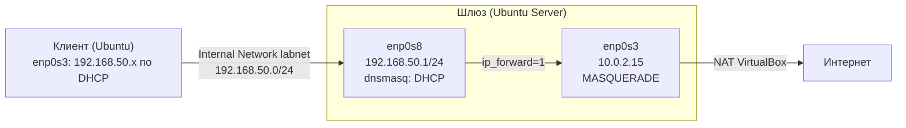

# linux-gateway-lab

Учебная лаба: Ubuntu Server в роли шлюза для изолированной сети VirtualBox. Сервер раздаёт клиентам адреса по DHCP, выпускает их в интернет через NAT и закрыт фаерволом ufw. Всё настроено вручную и проверено снифером (tcpdump), конфиги и скрипт развёртывания лежат в репозитории.

## Схема



## Что настроено

| Компонент | Как | Файл |
|---|---|---|
| Статический IP на LAN | netplan | `configs/netplan/60-lab.yaml` |
| DHCP-сервер | dnsmasq: пул .11–.100, аренда 12 ч, выдаёт шлюз и DNS | `configs/dnsmasq/lab.conf` |
| Маршрутизация | `net.ipv4.ip_forward=1` | `configs/sysctl/99-forward.conf` |
| NAT | `MASQUERADE` для 192.168.50.0/24 на внешнем интерфейсе, блок `*nat` в `/etc/ufw/before.rules` | `setup.sh`, шаг 5 |
| Фаервол | ufw: входящие запрещены, кроме SSH (22/tcp) и DHCP (67/udp на LAN); пересылка разрешена только LAN → интернет | `setup.sh`, шаг 6 |

NAT и фаервол настраивает один инструмент — ufw, чтобы правила не перетирали друг друга (подробнее в траблшутинге).

DNS в dnsmasq отключён (`port=0`), чтобы не конфликтовать с systemd-resolved за порт 53. Клиентам выдаётся внешний DNS.

## Развёртывание

1. VirtualBox, сервер: Adapter 1 — NAT, Adapter 2 — Internal Network `labnet`.
2. Клиент: Adapter 1 — Internal Network `labnet`, остальные адаптеры выключены.
3. На сервере:

```bash
git clone https://github.com/Arteeemm/linux-gateway-lab.git
cd linux-gateway-lab
sudo ./setup.sh
# если интерфейсы называются иначе:
sudo LAN_IF=enp0s9 WAN_IF=enp0s3 ./setup.sh
```

Скрипт идемпотентный: повторный запуск не дублирует блок NAT и правила ufw.

4. На клиенте: `sudo networkctl reconfigure enp0s3`.

## Проверка

| Что проверяем | Где | Команда | Ожидаемо |
|---|---|---|---|
| Клиент получил адрес | клиент | `ip a`, `ip r` | адрес из 192.168.50.11–100, `default via 192.168.50.1 proto dhcp` |
| Аренда записана | сервер | `cat /var/lib/misc/dnsmasq.leases` | MAC и IP клиента |
| Обмен DORA | сервер | `sudo tcpdump -ni enp0s8 -v 'port 67 or port 68'` | Discover/Request с `0.0.0.0.68 > 255.255.255.255.67` |
| NAT подменяет адрес | сервер | `sudo tcpdump -ni enp0s3 icmp` при `ping 8.8.8.8` с клиента | source 10.0.2.15, а не 192.168.50.x |
| Фаервол | сервер | `sudo ufw status verbose` | `deny (incoming)`, `deny (routed)`, правила 22/tcp, 67/udp, `ALLOW FWD` |
| Таблица трансляций | сервер | `sudo conntrack -L \| grep 8.8.8.8` | запись клиент ↔ 8.8.8.8 |

Вывод проверок с чистой VM после `setup.sh` — в `docs/`.

## Траблшутинг: что встретилось на практике

**Клиент без адреса, но и без 169.254.x.x.** При выключенном DHCP-сервере Windows назначает себе APIPA (169.254.x.x), а Ubuntu (systemd-networkd) по умолчанию нет: IPv4 просто отсутствует.

**Шлюз пингуется, 8.8.8.8 нет.** Проблема на самом шлюзе. Без `ip_forward` Linux не пересылает чужие пакеты; без `MASQUERADE` пакеты уходят наружу с частного адреса 192.168.50.x, и ответ не возвращается. Проверено: после удаления правила tcpdump на внешнем интерфейсе показывает source 192.168.50.x и отсутствие echo reply.

**Включил ufw — клиенты перестали получать адреса.** tcpdump на LAN показывает повторяющиеся Discover без Offer: пакеты доходят до сетевой карты, но `deny incoming` отбрасывает их до dnsmasq (tcpdump видит трафик до фаервола). Решение: `ufw allow in on enp0s8 to any port 67 proto udp`.

**Адрес есть, интернета нет, `ufw status` показывает `disabled (routed)`.** При включении ufw применяет `/etc/ufw/sysctl.conf` и сбросил `ip_forward` в 0, несмотря на `/etc/sysctl.d/99-forward.conf`. Решение: раскомментировать `net/ipv4/ip_forward=1` в `/etc/ufw/sysctl.conf`; после этого статус меняется на `deny (routed)`, и пересылку разрешает правило `ufw route allow in on enp0s8 out on enp0s3`.

**После перезагрузки NAT пропал.** Таблица nat оказалась пустой, `netfilter-persistent.service` не найден, `/etc/iptables/rules.v4` отсутствует. Причина: в Ubuntu пакеты `iptables-persistent` и `ufw` конфликтуют, установка ufw удалила `iptables-persistent`, и сохранённые правила перестали восстанавливаться при загрузке. Решение: оставить один инструмент — правило MASQUERADE перенесено в `/etc/ufw/before.rules`, ufw восстанавливает его вместе с остальными правилами.

**`tcpdump: can't parse filter expression: syntax error`.** Фильтр `port 67 port 68` некорректен, нужно `'port 67 or port 68'`.

**В tcpdump только Request и ACK, без Discover.** У клиента уже есть аренда, и он сразу просит продлить свой адрес. Для полного DORA: остановить dnsmasq, удалить `/var/lib/misc/dnsmasq.leases`, запустить снова.

**Клиент получил не первый адрес пула.** dnsmasq выбирает адрес по хэшу MAC, а не по порядку, чтобы устройство стабильно получало один и тот же IP.

**`dig @8.8.8.8 -x 8.8.8.8` возвращает пустой ответ.** Признаки подмены: флаг `aa` (публичный резолвер не авторитетен), время ответа 2 мс, нет секции OPT. Вывод: DNS-запросы перехватываются по пути до VM. Источник (провайдер, роутер или ПО на хосте) не установлен.

## Структура

```
.
├── setup.sh                     # развёртывание шлюза
├── configs/
│   ├── netplan/60-lab.yaml
│   ├── dnsmasq/lab.conf
│   └── sysctl/99-forward.conf
└── docs/                        # вывод проверок (dora, leases, nat-on, nat-off, conntrack)
```
